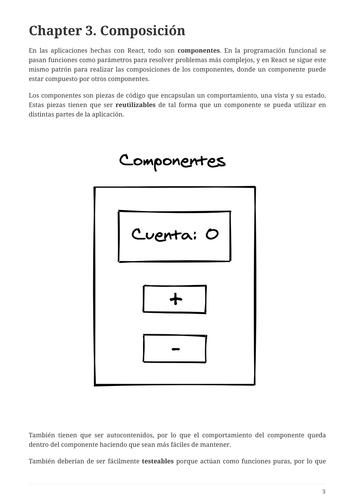
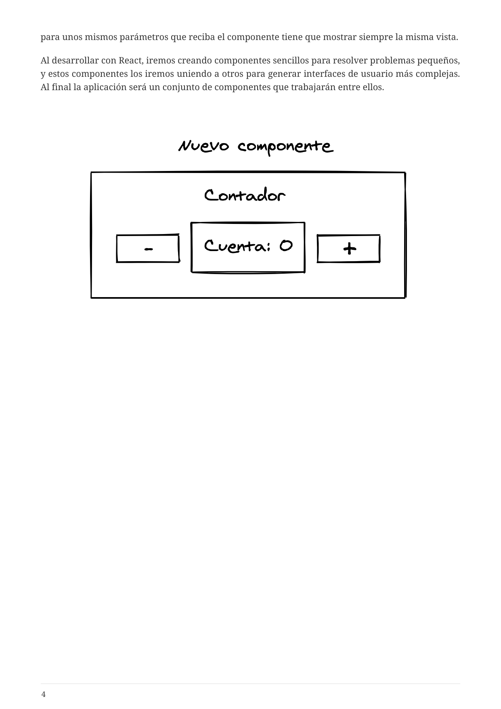

# 3. Composición

[← Índice](README.md) | [← Anterior: Requisitos](02-requisitos.md)

---

En React todo son **componentes**: piezas reutilizables que encapsulan vista, comportamiento y estado. Se componen unos dentro de otros para construir la interfaz.

Con TypeScript, los componentes reciben **props tipadas** y el IDE ofrece autocompletado y comprobación en tiempo de compilación.

**Figura 1 — Componente card**

**Figura 2 — Composición del componente card**

---

[Siguiente: 4. Modelo declarativo →](04-modelo-declarativo.md)
