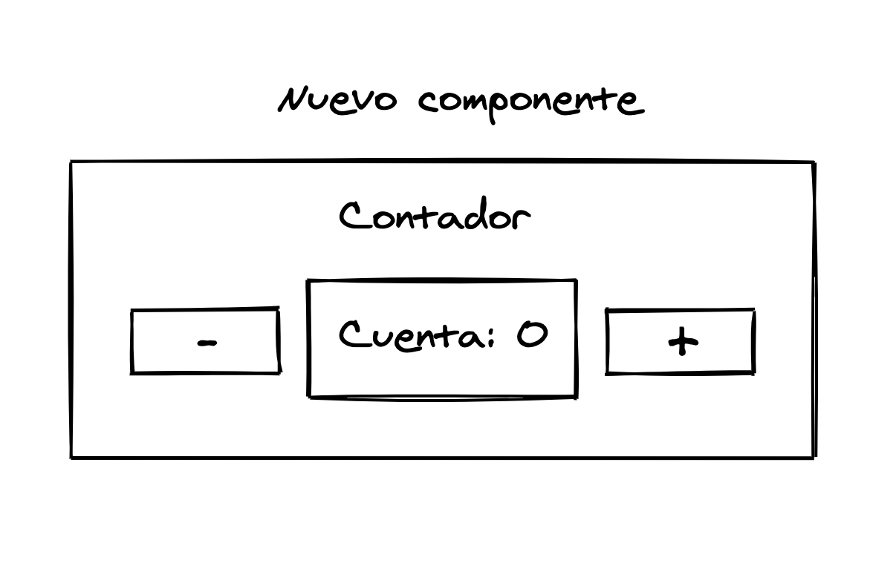

# 5. Virtual DOM

[← Índice](README.md) | [← Anterior: Modelo declarativo](04-modelo-declarativo.md)

---

React mantiene una representación en memoria del DOM (Virtual DOM). Ante cambios de estado:

1. Actualiza el Virtual DOM.
2. Compara con la versión anterior (diff).
3. Aplica solo los cambios mínimos al DOM real.

Trabajamos con componentes y estado; React se encarga de actualizar el DOM de forma eficiente.

---

[Siguiente: 6. React vs jQuery →](06-react-vs-jquery.md)
