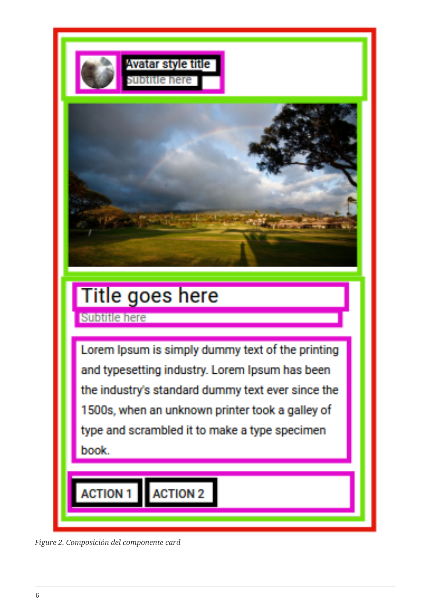

# 6. React vs jQuery

[← Índice](README.md) | [← Anterior: Virtual DOM](05-virtual-dom.md)

---

- **jQuery**: manipulación imperativa del DOM, eventos y datos repartidos.
- **React**: modelo declarativo, componentes, flujo de datos unidireccional y Virtual DOM. Con TypeScript añadimos tipos a props y estado.

---

[Siguiente: 7. Configuración con Vite →](07-configuracion-vite.md)
